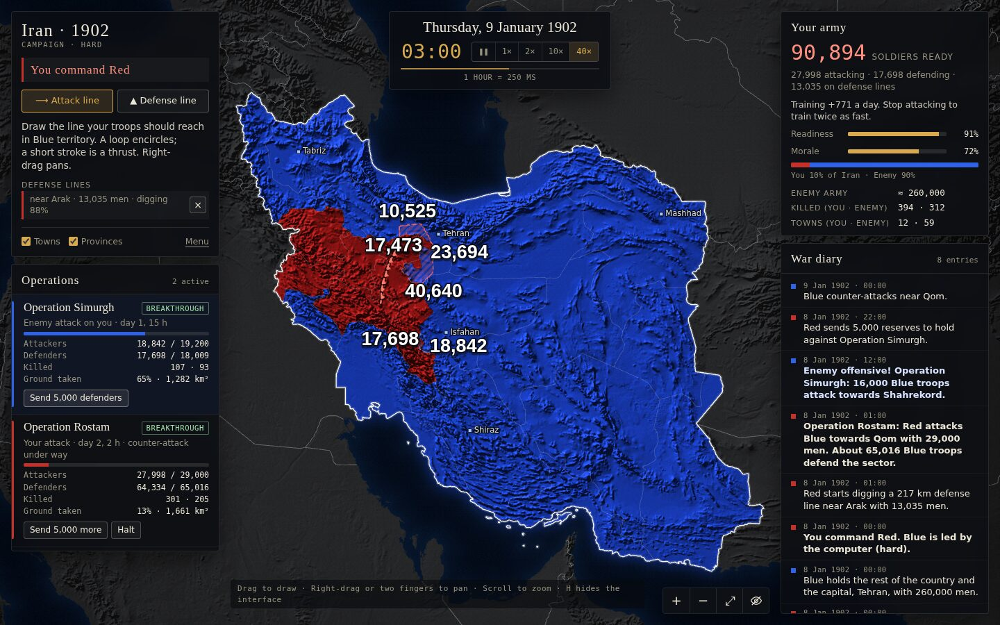

# Iran 1902 War Map

A real-time war map of Iran. Play a **campaign** against the computer as Blue or Red, or open the **sandbox** and give orders to both armies. Draw attack lines and defense lines, commit soldiers, and watch the battles move across the real terrain hour by hour. The war never stops for turns.



## Play

Open `index.html` in a modern browser (Chrome, Edge, Firefox or Safari with WebGL2). No server or build step is needed, and it works straight from disk. The menu offers:

- **Campaign** (Easy, Normal or Hard): you command one army, the computer the other.
- **Sandbox**: you give orders to both armies and choose any defense strength.

### Campaign

- **Soldiers are limited.** The army card shows how many are ready, how many are attacking, defending, or stationed on defense lines.
- **Rest to rebuild.** Every day new soldiers are trained and wounded men return. While you are not attacking, training runs twice as fast.
- **Fighting wears the army down.** Every offensive and every sector you defend lowers readiness, and tired troops fight worse. Attacking on several fronts, or attacking while you are also defending, leaves the rest of the front thin.
- **The enemy fights back.** The computer attacks towns near the front (especially ones it has lost), rushes reserves to sectors where you outnumber it, halts offensives that are failing, and digs its own defense lines. Its attacks appear as alerts.
- **Counter and reinforce.** Send 5,000 more men into your own attack, send 5,000 defenders against an enemy attack, or draw a counter-attack straight into an enemy salient.
- **Defense lines.** Draw one inside your own land. It needs 60 men per km for as long as it stands and 30 hours to dig. Enemy attacks that reach it face about three times the resistance. Stretches that are overrun are lost with their men.
- You win when the enemy holds no ground, and lose when you hold none.

### Giving orders (both modes)

1. **Pick a tool**: *Attack line* (`A`) or *Defense line* (`D`). In the sandbox, first pick Blue or Red.
2. **Draw.** Each stroke is added to the list of planned orders; nothing is replaced. Attack lines are reshaped into realistic front lines that bend towards rivers and broken ground. Everything between your front and the line becomes the objective, shown hatched.
   - A line that crosses enemy land is a **front-line offensive**. Ends that stop short are tied to the nearest edge.
   - A closed loop is an **encirclement**; a short arrow deep into enemy land is a **thrust**.
   - ⇄ takes the other side of a line when that is a comparable piece; × removes an order.
3. **Carry them out.** One press launches every planned order together. For each attack, choose the troops to commit (and, in the sandbox, the enemy's defense strength). Each attack shows the defenders it will meet, the force ratio, and a forecast of duration and losses.
4. **Watch.** The big numbers on the map are the men fighting, the attacker's on his side of the front and the defender's on the other. Long fronts are split into sectors, each with its own pair of numbers; zoom in to see them all. Press `H` to hide the interface.
5. An offensive ends when it takes its objective, runs out of men, or bogs down. You can also halt it and keep the ground taken.

### Panels

- **Operations**: every running offensive with its status (breakthrough, advancing, heavy fighting, stalled), attackers and defenders remaining, killed on both sides, ground taken, and buttons to reinforce or halt. Click an operation's name to fly to its battle.
- **Your army** (campaign) or **Forces** (sandbox): soldiers ready and where the rest are, training per day, readiness and morale, territory, towns, killed; the sandbox table adds wounded, prisoners, provinces, population and the balance of power.
- **War diary**: offensives, towns occupied and liberated, counter-attacks, encirclements, surrenders, breached defense lines and enemy alerts.

### Time

The war starts on **8 January 1902, 00:00**. The clock advances by the hour.

| Speed | Real time per hour |
|-------|--------------------|
| 1×    | 10 s               |
| 2×    | 3 s                |
| 10×   | 1 s                |
| 40×   | 0.25 s             |

### Controls

| Action | Mouse / keyboard | Touch |
|--------|------------------|-------|
| Draw an attack or defense line | Left-drag with a tool picked; `A` / `D` switch tools | One finger |
| Pan | Right- or middle-drag, or left-drag with no tool picked | Two fingers |
| Zoom (down to a few km across) | Scroll wheel, `+` / `−`, double-click | Pinch |
| Show all of Iran | `F` or ⤢ | ⤢ |
| Hide / show the interface | `H` or the eye button | Eye button |
| Pause / resume | `Space` | ❚❚ |
| Speed | `1`–`4` | Speed buttons |
| Remove the last planned order | `Esc` | × on the order |

The game is saved in the browser and resumes where you left it. **Menu** starts a new campaign or sandbox. Blue starts with 260,000 men, Red with 150,000.

## How the fighting is simulated

Iran is divided into a grid of about 385,000 cells of roughly 2 × 2 km. Ownership changes cell by cell, in real time.

- **Armies.** Each offensive has the troops you committed. About a third hold the whole front thinly; the rest form one to four **battle groups** that concentrate on narrow sectors. Where a battle group presses, the front breaks; elsewhere it barely moves.
- **Defenders.** The defending side puts men into the sector according to the defense strength, limited by what it has free after its other commitments. It brings up reserves against each thrust, so a breakthrough slows down after a day or so. The attacking group then stalls and shifts its effort to another part of the front.
- **Counter-attacks.** Defenders strike the flanks of salients and retake ground for a few hours.
- **Ground.** Mountains (measured from the shaded relief) slow movement and favour the defender; rivers are hard to cross; towns are fortified and hold out, so the front flows around them.
- **Outflanking.** Ground surrounded on several sides falls quickly. Territory cut off completely loses supply, fights ever more weakly and finally surrenders, and its garrison is taken prisoner.
- **Losses.** Casualties come from the strength of both sides along the engaged front; about 30% are killed. An offensive whose men fall below a minimum, or that stops gaining ground for a day, ends.
- **Morale, readiness and training.** Taking towns and provinces raises morale; losses and encirclements lower it. Fighting lowers readiness, which recovers with rest. Both make troops fight better or worse. Each side trains soldiers from a fixed draft plus the population it holds, twice as fast while not attacking, and part of the wounded return to duty. Power combines army size, morale, population and towns.
- **Defense lines** multiply the defender's strength on the cells they cover once dug; captured stretches are lost with part of their garrison.
- **Campaign defenders.** When a sector is attacked, the defender pulls a share of its free soldiers into it: more for a wide attack on a short front. That is why committing men elsewhere weakens your defense.

The renderer draws ownership per pixel from the grid, with a fractal edge, so borders stay irregular and natural at every zoom level.

## Project layout

```
index.html          page and UI markup
css/style.css       interface styles
js/util.js          noise, heap, calendar, decoding helpers
js/world.js         simulation grid and ownership
js/planner.js       turns a drawn line into a realistic front and an objective
js/sim.js           battle engine: armies, battle groups, counter-attacks, pockets, defense lines,
                    training and readiness, forecasts
js/ai.js            the computer opponent for the campaign
js/renderer.js      WebGL2 map: stencilled land/water/Iran, relief shading, live ownership
js/overlay.js       borders, lines, spearhead arrows, troop numbers, town labels (Canvas 2D)
js/app.js           clock, camera, input, panels
js/data/*.js        generated map data (do not edit)
tools/              data build, single-file bundler, headless simulation check
```

## Map data

All geography comes from [Natural Earth](https://www.naturalearthdata.com) (public domain):

- 1:10m admin-0 countries, land boundaries, admin-1 provinces and province lines
- 1:10m populated places and rivers
- 1:10m shaded relief raster (`SR_HR`), reprojected to Web Mercator

To rebuild `js/data/` you need Node 18+ and ImageMagick, plus local copies of the two Natural Earth repositories:

```sh
git clone --depth 1 --filter=blob:none --sparse https://github.com/nvkelso/natural-earth-vector
git -C natural-earth-vector sparse-checkout set geojson
git clone --depth 1 --filter=blob:none --sparse https://github.com/nvkelso/natural-earth-raster
git -C natural-earth-raster sparse-checkout set 10m_rasters/SR_HR

node tools/build-data.mjs natural-earth-vector natural-earth-raster
```

## Checks and builds

```sh
node tools/sim-check.mjs [defense] [seed] [troops]   # opposing offensives, then 20 days of AI against AI
node tools/bundle.mjs                                # single-file build in dist/
```

## Pace and operation control

Fronts move at most about 20 km a day, and much less against real resistance.
A small push takes a few days. A large offensive across a province takes weeks or months.

- **Advice:** an attack that bleeds troops or stops gaining ground shows a recommendation to halt it.
- **Halting:** costs about 8% of the attacking force and leaves that sector shaken for a week, so it is easier to attack.
- **Operation controls:** you can Boost, Withdraw troops, or build a New plan from an existing attack.
- **Counter-attack:** when a defense is clearly winning, a Counter-attack button appears.
- **AI:** the computer halts hopeless attacks and counter-attacks in the same way.
- **Timelapse:** after a match, or from the footer, replay the war in slow, fast or very fast mode, with the date shown.

## Removing defense lines

There are three ways to remove a defense line, and its garrison returns to the reserve each time:
- Right-click the line on the map.
- With the Defense line tool selected, tap the line.
- Press **Remove** next to it in the Defense lines list. **Remove all lines** clears every one of them.

## Casualties

Losses are permanent. Of the men lost in fighting, about 30% are killed and stay dead, and the **Killed** count only ever goes up.

Wounded men can recover and rejoin, but only from the wounded pool. New soldiers come only from training.

Every soldier in an attack, a defended sector or a defense line is part of the army. When deaths or surrenders leave fewer soldiers than are committed, those units shrink to match. Defenders are drawn only from soldiers who are actually free, and a counter-attack moves men rather than doubling them.

## No leftover enemy spots

Territory stays clean:
- **Winning an attack** captures the rest of its objective.
- **When any attack ends**, small enemy patches left behind the new line surrender at once.
- **During play**, any cut-off scrap of up to about 600 km² that touches the other side surrenders within two game hours. This includes scraps backed onto a foreign border or the coast.
- **Larger encirclements** still hold out for a while before they surrender.
- **Real islands in the Gulf** are left alone.
